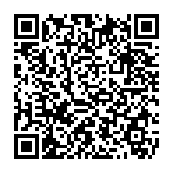
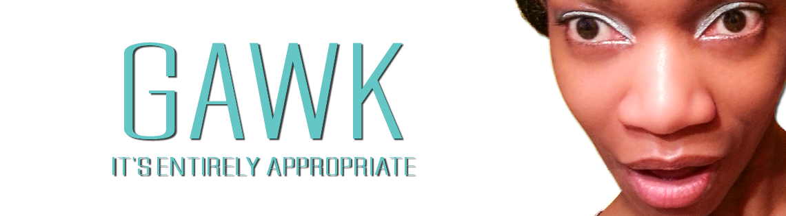

# Creas Crave Capstone

###### <a href="https://www.latoniamertica.dev/creas-crave-capstone/" target="_blank">visit Creas Crave Capstone by La'Tonia Mertica</a>

*capstone project: creas crave homepage with functional immediate search, gumroad api for cart/purchasing, openWeatherApi for current temperatures, and more. ..part of full stack project.. . github pages deploy for home aka capstone page ... accompanied by separate heroku app deploys for portal and backend...*
 

**HOW WORKS**
- enter keyword(s) for search ... auto-returned results in body ... no change means invalid keyword 
- click profile icon to access user/admin portal for accounts (i.e. purchase history; creatives favorited; edit/delete user account) 
- enter email to subscribe or unsubscribe
- click:
  - CONNECT to access digital portfolio gateway
  - MY STORY for brief code/web dev-specific insight
  - PRICING for basic cost per video 
  
**NOTE:** contact administrator aka La'Tonia Mertica to discuss no-cost use w/full creative's credit 

**NEXT STEP**  
1. scale to multiple blocks of creatives (i.e. add industrial-focused creatives)
2. add media queries for optimized presentation on various device/screen sizes
3. scale search functionality to expand video-specific keywords may enter
4. maintain full stack code
5. promote/market to target audience(s)
6. scale to viable resource for passive income
7. regularly review, tweak, optimize per metrics

 

 

##### FIRST NAME: La'Tonia Mertica
###### note_1: pronounced *luh tone yuh merr treece*
 

## MY BACK STORY
 
I went into code because I saw code as a gateway to better options, informed risk-taking, and outcomes. 
 
 
My fantasies on a better life are nothing special. A better life, life quality, and sense of self. A life during which I create opportunities for the substance of my existence. A life I enthusiastically own. A life that welcomes, entertains, and bows to parts of myself I've envisioned embracing for too long - focusing on non-me things out of a sense of duty, and obligation, and misaligned timing. Nothing special. Still, my own, and true difference.  
 
 
When I was notified I was accepted into Hack Upstate full stack javascript code/web dev bootcamp Careers in Code, I knew my life was changed. 
 
 
Far from perfect, and likely destined to never truly achieve the level and status I fantasize on, I code every day. I apply my best self. Dwell in the moment - to moment. Never forget how hard life has been at times. And that debatably I shouldn't be alive today. But I am. Building out the purpose of my life is a lot to do - and I still don't have authenticated clarity on it. 
 
 
Still, it involves vigorous exceptional communication - and, coding is now part of my fierce means to say some things.
 
 

